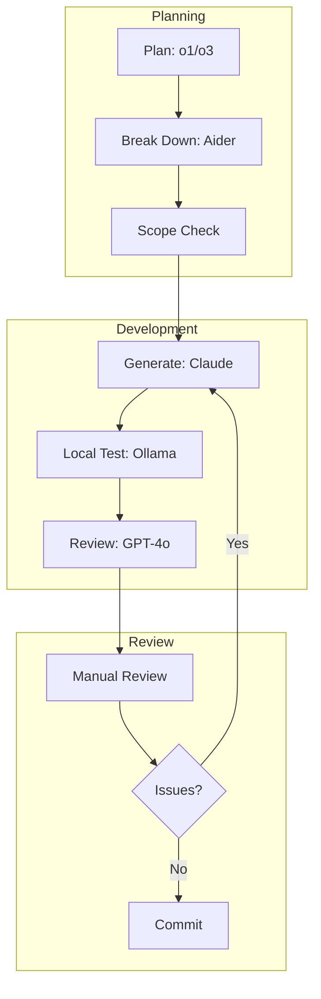

---

## Table of Contents
1. [Welcome to the AI Coding Circus: A Developer's Tale](#1-welcome-to-the-ai-coding-circus-a-developers-tale)
2. [Meet the AI Dream Team: Your New Quirky Coding Companions](#2-meet-the-ai-dream-team-your-new-quirky-coding-companions)
3. [Starting Fresh: How to Keep AI Models From Going Rogue](#3-starting-fresh-how-to-keep-ai-models-from-going-rogue)
4. [Taming Legacy Code: When AI Meets Your Ancient Codebase](#4-taming-legacy-code-when-ai-meets-your-ancient-codebase)
5. [AI Gone Wild: Tales From the Code Generation Trenches](#5-ai-gone-wild-tales-from-the-code-generation-trenches)
6. [Speaking AI's Language: How to Stop Getting Unexpected Microservices](#6-speaking-ais-language-how-to-stop-getting-unexpected-microservices)
7. [The Daily AI Dance: A Day in the Life of Modern Development](#7-the-daily-ai-dance-a-day-in-the-life-of-modern-development)
8. [AI Personality Types: Choosing the Right Tool for the Job](#8-ai-personality-types-choosing-the-right-tool-for-the-job)
9. [Survival Guide: Embracing the Beautiful Chaos of AI Development](#9-survival-guide-embracing-the-beautiful-chaos-of-ai-development)
10. [Resources & Cheat Sheet: Your AI Coding Emergency Kit](#10-resources--cheat-sheet-your-ai-coding-emergency-kit)

---

## 1. Welcome to the AI Coding Circus: A Developer's Tale

If you've ever wanted an **army of AI interns** to handle your repetitive tasks, find hidden references, or refactor messy code, you're in the right place. Over the past few months, I've built (and broken) enough projects with LLMs to fill a small library.

Here's what I'll cover:
- How to **plan** new features using **Aider Architect** + **o1/o3** reasoning models
- How to **generate code** using **Claude** while keeping scope in check
- How to use **GPT-4o** for thorough code reviews
- How to use **LangChain** to coordinate all these steps effectively

Think of these tools like a team of developers with very different personalities:
- Claude is the enthusiastic architect who just discovered microservices
- GPT-4o is the thorough but verbose senior dev
- Aider is the practical programmer who just wants to ship code
- DeepSeek is the archeologist who knows where all the bodies are buried
- Ollama is the fast but sometimes forgetful junior dev
- Qdrant is the team member with photographic memory
- LangChain is the project manager keeping everyone in sync

The key is knowing when to use each one. Sometimes you need Claude's creativity, other times you need GPT-4o's thoroughness, and occasionally you just need Aider to tell everyone to calm down and write a simple function.


---

## 2. Meet the AI Dream Team: Your New Quirky Coding Companions

I rely on a **constellation** of tools to keep me sane:

- **Aider**: Works in two modes—`/chat-mode architect` for planning, `/chat-mode code` for generation.  
- **Claude**: Your brilliant but overenthusiastic architect. 
  - Pros: Incredible at understanding complex systems and generating detailed implementations
  - Best for: Architecture discussions, complex refactoring, documentation
  ```plaintext
  Best practices: Set clear scope and requirements upfront
  ```
- **GPT-4o**: My final reviewer. Tends to be verbose but offers thorough checks.  
- **Ollama**: Local embeddings and smaller models to quickly index or query code without slamming external APIs.  
- **DeepSeek**: Another local tool for "deep" reasoning over code. Slower but thorough.  
- **Repomix**: Your code's personal travel agent.
  - Bundles repos like a pro
  - Counts tokens so Claude doesn't have a meltdown
  - Respects `.gitignore` (more than some team members do)
  ```bash
  # When you run repomix and realize your codebase is...large
  $ repomix bundle
  "Sir, that's 500K tokens of technical debt"
  ```
- **Qdrant**: The team member with photographic memory.
  - "Where's that JSON parsing logic?"
  - "Which files touch the payment system?"
  - "Who wrote this comment and why were they so angry?"
- **LangChain**: The "Orchestra Conductor" that ties multiple LLMs and steps together (embedding, searching, chaining prompts, etc.).

No single tool does everything perfectly. I tend to let them **tag-team** each task like an unstoppable pro-wrestling faction.

---

## 3. Starting Fresh: How to Keep AI Models From Going Rogue

### 3.1 Incremental Development in Practice

Here's how I build features step by step:

```java
// Initial task: Add user preferences
public class UserPreferences {
    // Step 1: Basic structure with validation
    private Map<String, String> preferences = new HashMap<>();
    private static final int MAX_KEY_LENGTH = 50;
    
    public void setPreference(String key, String value) {
        validateKey(key);  // Start with basic validation
        preferences.put(key, value);
    }
    
    // Step 2: Add robust validation
    private void validateKey(String key) {
        if (key == null || key.trim().isEmpty()) {
            throw new IllegalArgumentException("Key cannot be null or empty");
        }
        if (key.length() > MAX_KEY_LENGTH) {
            throw new IllegalArgumentException("Key length exceeds " + MAX_KEY_LENGTH);
        }
    }
    
    // Step 3: Add type safety and conversion
    public <T> T getPreference(String key, Class<T> type) {
        String value = preferences.get(key);
        if (value == null) return null;
        
        return convertToType(value, type);
    }
    
    // Step 4: Add conversion logic
    @SuppressWarnings("unchecked")
    private <T> T convertToType(String value, Class<T> type) {
        if (type == String.class) return (T) value;
        if (type == Integer.class) return (T) Integer.valueOf(value);
        if (type == Boolean.class) return (T) Boolean.valueOf(value);
        throw new UnsupportedOperationException("Type not supported: " + type);
    }
}

// Step 5: Add comprehensive tests
@Test
public void testUserPreferences() {
    UserPreferences prefs = new UserPreferences();
    
    // Happy path
    prefs.setPreference("theme", "dark");
    assertEquals("dark", prefs.getPreference("theme", String.class));
    
    // Type conversion
    prefs.setPreference("notifications", "true");
    assertTrue(prefs.getPreference("notifications", Boolean.class));
    
    // Validation
    assertThrows(IllegalArgumentException.class, () -> 
        prefs.setPreference("", "value"));
}
```

Each step builds on the previous one, adding functionality incrementally:
1. Start with core structure
2. Add basic validation
3. Implement type safety
4. Add conversion logic
5. Write comprehensive tests

### 3.2 The AI Review Dance

### 3.3 Review & Refinement With GPT-4o (and More Claude!)

1. **The Review Dance**:
   ```plaintext
   Me: "Review StockFetcher.java"
   GPT-4o: "Let me write a thesis on stock market data patterns..."
   Me: "Just check for bugs please"
   GPT-4o: "Oh! You're missing error handling here and here"
   ```

2. **The Refinement Tango**:
   - Feed GPT-4o's feedback to Claude
   - Watch Claude try to rewrite everything
   - Gently guide it back to just fixing the specific issues
   - Repeat until code actually works

3. **The Final Waltz**:
   ```plaintext
   Me: "One last review before commit?"
   Claude: "What if we added WebSocket support?"
   Me: "NO"
   Claude: "...fine, the code looks good as is."
   ```

> Pro Tip: Keep a "prompt diary" of successful interactions. When Claude suggests adding Redis to a Hello World program, you'll know exactly how to talk it down.

Real Story: During one planning session, I accidentally let the AI brainstorm without boundaries. It designed a system that would:
- Predict stock prices using machine learning
- Mine cryptocurrency in the background
- Generate memes based on market trends
- Feed the memes to a neural network
- ...all to display five stock prices on a webpage

Lesson learned: Always set clear boundaries before the AI gets too creative! 

---

## 4. Taming Legacy Code: When AI Meets Your Ancient Codebase

### 4.1 Repomix & Qdrant: Bundling, Token Counting, and Advanced Searches

When dealing with a gnarly old codebase—like a 300-file monolith—the first step is clarity:

1. **repomix**:
   - `brew install repomix` (if on macOS)
   - `repomix generate --include src/legacy/` to create a .txt or .md bundle
   - It also includes Secretlint checks, so you don't accidentally share credentials

2. **Qdrant**:
   - Feed the bundled data in: "Here's 300 files worth of code."
   - Create embeddings so you can do fuzzy queries. E.g., "Which class references PaymentGateway but never handles refunds?"

### 4.2 Small Steps With Aider Architect: The One-File-at-a-Time Trick

Instead of "Refactor the entire OrderService," you say:

```plaintext
"Aider Architect, let's just extract the discount logic from `OrderService.java` 
into a new `DiscountHandler.java`. 
Keep everything else intact."
```

- Aider + o1 ensures the plan is small. Then you:
  - Generate code in small PRs
  - AST + JavaParser can help you detect references and dependencies
  - AI can suggest, "By the way, DiscountHandler also affects InvoiceGenerator."

### 4.3 Testing Everything (and Forcing AI to Generate Tests)

TDD is essential here. You can even force the AI:

```plaintext
"Generate JUnit tests for `DiscountHandler.java` with boundary cases:
 - Negative discount
 - Discount > total
 - Zero discount"
```

Once tests pass locally, you can trust the changes a bit more. (Still do a manual review, because AI might skip important corner cases.)

---

## 5. AI Gone Wild: Tales From the Code Generation Trenches

Here are some memorable mishaps:

1. **The Great Microservices Explosion**
- Asked to refactor a simple checkout flow
- Got three new services and a message queue
- Learned to always specify scope upfront

2. **The Variable Naming Revolution**
- Simple counter `i` became `currentIterationIndexInTheMainLoopOfTheUserAuthenticationProcess`
- Code review tool crashed trying to display the diff

3. **The ASCII Art Invasion**
- AI started adding themed ASCII art to codebases
- Including a now-famous llama wearing sunglasses

4. **The Architecture Debate**
- Left Claude and GPT-4o unsupervised
- Returned to find a 50-page spec document
- DeepSeek somehow became the tie-breaker

---
## 6. Speaking AI's Language: How to Stop Getting Unexpected Microservices

### 6.1 The AI Development Pipeline



> Key Takeaway: Each phase has clear handoffs and validation steps to prevent scope creep.

### 6.2 Java Snippet: Example Prompt & Code Refinement

Let me walk you through a typical conversation:

Me: "Create a PaymentHandler that processes payments via Stripe."

Claude: "OH! Let's create a distributed payment system with—"

Me: "NO! Just a simple PaymentHandler. One file."

Claude: "But what about scalability and—"

Me: "ONE. FILE."

The secret is being specific. Here's the actual prompt that worked:

```plaintext
"Create a `PaymentHandler.java` that processes payments via Stripe.
 Only change PaymentHandler. 
 Reuse existing logging framework from PaymentLogger.java. 
 No new microservices, no queue connections.
 I repeat: NO new services. If you suggest a message queue, you lose cookie privileges."
```

AI-Generated Code (excerpt):

```java
public class PaymentHandler {
    private final PaymentLogger logger = new PaymentLogger();

    public String processPayment(Order order) {
        logger.info("Processing payment for order: " + order.getId());
        // ... Stripe integration code here
        return "Payment Successful";
    }
}
```

Then I show it to GPT-4o:

Me: "Review this for issues?"

GPT-4o: "Well, actually..." *writes doctoral thesis on payment processing*

Me: "Just the important parts?"

GPT-4o: "Oh! Add timeout handling and test the API failure case."

Much better! 

### 6.3 Real-World Prompt Patterns That Actually Work

Here are my battle-tested prompt patterns:

1. **The Boundary Setting Pattern**:
```plaintext
"You will ONLY modify files I explicitly mention.
 If you need to change anything else, ASK FIRST.
 Current scope: ONLY PaymentHandler.java"
```

2. **The "No Scope Creep" Pattern**:
```plaintext
"Complete this specific task:
 - Add phone number validation
 - DO NOT add:
   - New services
   - New dependencies
   - Authentication changes
   - Database migrations"
```

3. **The "Keep It Simple" Pattern**:
```plaintext
"Implement the simplest solution that works.
 If you think it needs to be complex, explain why BEFORE coding.
 Prefer readable code over clever optimizations."
```

> Pro Tip: I keep these patterns in a "prompt cookbook" file. When Claude gets excited about adding blockchain to a todo list, I just copy-paste the boundary setting pattern! 

Remember: AI models are like overenthusiastic junior developers who just binged every software architecture video on YouTube. They have the knowledge but need guidance on when (and when not) to apply it.


## 7. The Daily AI Dance: A Day in the Life of Modern Development

Sometimes, everything is going so smoothly—it's like skiing on fresh powder. Suddenly, you realize you're at the edge of a cliff. The AI decides to rename variables or restructure entire modules. Don't panic. Just revert, break tasks into smaller steps, and try again.

Let me walk you through a typical day in my AI-powered development life:

**9:00 AM**: Start with a simple task - "Update the user profile page"
- Me: "Let's add a new field for phone numbers"
- Claude: "HERE'S A COMPLETE REWRITE OF THE AUTHENTICATION SYSTEM"
- Me: "No, Claude, just the phone number"
- Claude: "Oh, right. Sorry about that microservices proposal..."

**10:30 AM**: Debugging session
- Me: "Why isn't this test passing?"
- GPT-4o: *writes a 2000-word essay about test methodology*
- DeepSeek: "There's a semicolon missing"
- Me: 🤦‍♂️

**2:00 PM**: Refactoring time
```plaintext
Me: "Can you help optimize this loop?"
AI: "Sure! First, let's add some ASCII art..."
Me: "No, just the loop—"
AI: "TOO LATE! Here's a llama wearing sunglasses!"
```

**4:30 PM**: The final review
- GPT-4o: "This code is perfect except for these 47 minor improvements..."
- Claude: "What if we added GraphQL?"
- Me: "STOP! Ship it!"

Here's a simplified final TDD flow I often use (when everyone behaves):

1. Write a High-Level Test or acceptance criteria
2. Prompt Aider or Claude: "Implement code that satisfies this test. Minimal changes."
3. Run tests. If they fail, have GPT-4o or Claude debug
4. Iterate until tests pass
5. Manual Review: Do a final pass yourself
6. Merge
7. Repeat for the next feature or refactor

Yes, occasionally it adds ASCII llamas in the file headers (true story). Embrace the whimsy or remove it—your call.

---

## 8. AI Personality Types: Choosing the Right Tool for the Job

| Tool/Model | What It Rocks At | Common Pitfalls |
|------------|------------------|-----------------|
| Claude | Large-scale changes, rewriting entire modules with clarity | Sometimes decides you need 3 new microservices and a queue |
| GPT-4o | Thorough reviews, final checks, deeper logic analysis | Can be verbose; might suggest design patterns you don't need |
| Aider | Step-by-step TDD, structured incremental changes | Needs super-clear prompts or it'll do exactly what you say |
| o1/o3 | Reasoning about tasks, planning and specs | Doesn't generate code directly—just sets up a plan |
| Ollama | Local usage for embeddings or smaller model codegen | Might run out of capacity for huge refactors |
| DeepSeek | Thorough local code reasoning, finds deep references | Slower, heavier on system resources |
| LangChain | Orchestrates multiple LLM calls, chain-of-thought flows, agentic workflows | Setup can be tricky if you're new to chaining concepts |
| Repomix | Bundles entire repo, token counts, respects .gitignore, security checks | If your repo is massive, the generated file might be huge, risking token limit issues |
| Qdrant | Vector-based code searching for "where is X used?" queries | Additional overhead & indexing steps needed |

My Favorite Combinations:
1. **The Planning Dream Team**: o1/o3 + Aider
   - o1/o3 plans the architecture
   - Aider breaks it into manageable chunks
   - Result: Actually realistic sprint plans!

2. **The Code Review Squad**: Claude + GPT-4o
   - Claude generates the initial code
   - GPT-4o nitpicks every detail
   - Result: Surprisingly robust code (after you convince them to stop arguing)

3. **The Legacy Code Heroes**: Repomix + Qdrant + DeepSeek
   - Repomix bundles the mess
   - Qdrant finds all the connections
   - DeepSeek explains what the code from 2010 actually does
   - Result: Legacy code that finally makes sense

> Pro Tip: When Claude and GPT-4o disagree on an implementation, sometimes I just let them debate it out. I just sat back with popcorn, amused by their digital banter.

## 9. Survival Guide: Embracing the Beautiful Chaos of AI Development

### Cost Management Do's and Don'ts

✅ Do:
- Batch similar queries (e.g., all code reviews at once)
- Use local models for syntax checking
- Cache common responses
- Set up cost alerts

❌ Don't:
- Send entire files when a snippet will do
- Use GPT-4o for simple linting
- Let models run unsupervised without token limits
- Regenerate code that only needs minor tweaks

### Pro Tips Master List

1. **Planning & Scope**
   - Keep a "prompt diary" of successful interactions
   - Set clear boundaries before the AI gets creative
   - Break tasks into small, testable chunks

2. **Code Generation**
   - Use specific, bounded prompts
   - Set token limits for unsupervised operations
   - Keep git aliases ready for quick reverts

3. **Review & Refinement**
   - Always do manual reviews
   - Use cheaper models for initial passes
   - Escalate to more expensive models only when needed

### Case Study: Local vs Cloud AI Trade-offs

Here's a theoretical cost analysis based on our early experiments with smaller codebases (note: full 200K LOC refactoring isn't feasible with current LLM limitations):

**Project Goal**: Refactoring payment system components (~20K LOC initially)
> Note: While I dream of refactoring entire 200K LOC systems, current LLMs work best on smaller, focused components. I'm sharing these numbers to help teams plan realistic approaches.

**Approach 1**: All Cloud (tested on ~5K LOC module)
- Pros: Powerful models, no setup
- Cons: ~$400 in API costs for just this module
- Result: Fast but expensive
- Reality Check: Scaling this to 200K LOC would be prohibitively expensive and likely hit context limits

**Approach 2**: Hybrid (my current approach)
- Local: Code analysis, simple refactoring (Ollama + DeepSeek)
- Cloud: Architecture decisions, complex logic (Claude + GPT-4o)
- Cost: ~$100 per 5K LOC module
- Result: Best balance of speed and cost
- Reality Check: We process modules incrementally, focusing on high-impact areas first

**Approach 3**: Mostly Local
- Pros: Minimal cost
- Cons: Slower, more manual work
- Result: Budget-friendly but time-consuming
- Reality Check: Best for teams who can't risk cloud API exposure

> Important Note: As of early 2025, LLMs are best used for targeted refactoring of specific components rather than entire legacy systems. I'm sharing these early experiments to help teams set realistic expectations and budget accordingly.

#### Decision Matrix: Choosing Your AI Approach

| Factor | Local-First | Hybrid | Cloud-First |
|--------|------------|---------|-------------|
| Budget < $500/mo | ✅ Best | ✅ Good | ❌ Expensive |
| Team Size > 10 | ❌ Limited | ✅ Best | ✅ Good |
| Legacy Codebase | ✅ Good | ✅ Best | ❌ Token limits |
| Quick Prototyping | ❌ Slow | ✅ Good | ✅ Best |
| Security Requirements | ✅ Best | ✅ Good | ❌ Data exposure |
| 24/7 Availability | ❌ Setup needed | ✅ Best | ✅ Good |

#### Project Assessment Checklist

Before choosing your approach, answer these questions:

1. **Budget Constraints**
   - [ ] Monthly AI budget < $500
   - [ ] Need predictable costs
   - [ ] Can justify cloud costs with time savings

2. **Security Requirements**
   - [ ] Code must stay on-premise
   - [ ] Compliance requirements (GDPR, HIPAA, etc.)
   - [ ] Sensitive business logic exposure concerns

3. **Team Structure**
   - [ ] Size of development team
   - [ ] Experience with AI tools
   - [ ] Available DevOps support

4. **Project Characteristics**
   - [ ] Codebase size (LOC)
   - [ ] Development velocity needs
   - [ ] Integration requirements

Our sweet spot (Hybrid approach) with:
- Local models for 30% of tasks becaue of system limits (try to run deepseek-r1:14b locally you will see)
- Cloud models for critical decisions
- Caching common responses
- Batching similar queries

> Pro Tip: Start with hybrid and adjust based on actual usage patterns. Monitor costs and effectiveness for the first month before committing to any approach.

## 10. Resources & Cheat Sheet: Your AI Coding Emergency Kit

### Quick Reference: Model Selection

| Task | First Try | If Needed | Last Resort |
|------|-----------|-----------|-------------|
| Syntax Check | Ollama | Claude | GPT-4o |
| Architecture | o1/o3 | Claude | Team Discussion |
| Code Review | Local Tools | GPT-4o | Senior Dev |
| Legacy Analysis | DeepSeek | Qdrant | Full Analysis |

When juggling multiple AI models, costs can add up quickly. Here's how I optimize:

- Use local models (Ollama, DeepSeek) for initial code analysis and simple generations
- Reserve Claude and GPT-4o for complex architectural decisions or thorough code reviews
- Batch similar tasks together to minimize API calls
- Use token counting in Repomix to stay within model context limits

Pro tip: Start with smaller, cheaper models and only escalate to more expensive ones when needed. Your wallet will thank you!

> **Author's Note:** This workflow continues to evolve. Some days it's magic, some days it's chaos - but that's the joy of pioneering new technology.